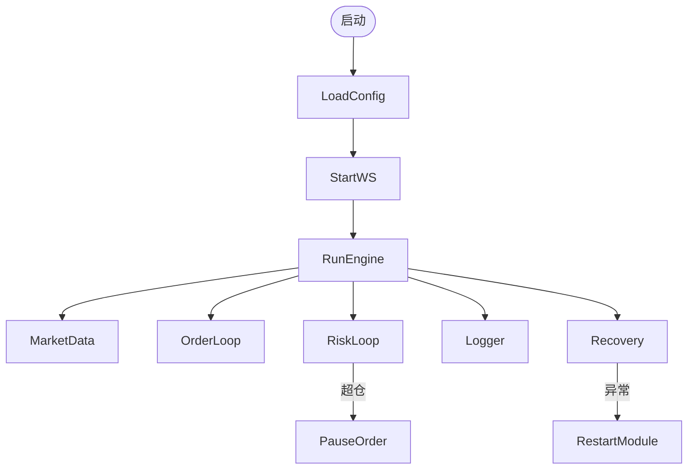
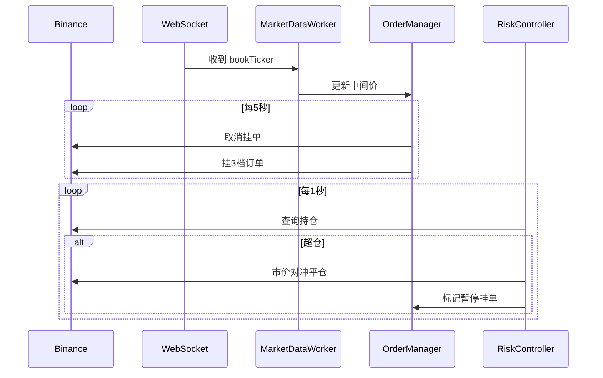

# PMM 做市商系统 - MVP 原型设计文档

> 版本：v0.1 作者：Yanker Jang  日期：2025-07-15

---

## 🎯 目标

构建一个基于 Binance Testnet 的最小可用做市商系统（PMM），具备：

- 3 档挂单逻辑（中间价上下偏移）
- 异步非阻塞结构，确保稳定性和高可用
- 支持指标采集、风控处理、错误恢复
- 易于拓展、调试、部署

---

## 📁 项目结构

```text
quant_pmm/
├── main.py                     # 程序入口
├── config.yaml                 # 策略配置
├── .env                        # API密钥等敏感数据（不入版本）
├── core/
│   ├── engine.py               # 主执行调度器
│   ├── state.py                # 共享状态结构
│   ├── market.py               # 行情订阅与处理器
│   ├── order.py                # 挂单管理器
│   ├── risk.py                 # 风控模块
│   ├── logger.py               # 日志采集器
│   └── recovery.py             # 容错与异常监控器
├── utils/
│   ├── config_loader.py        # 加载 .env + yaml
│   ├── http.py                 # Binance REST 封装
│   └── ws.py                   # WebSocket 封装
├── test/
│   ├── test_order.py           # 挂单模块测试
│   ├── test_risk.py            # 风控模块测试
│   └── ...                     # 更多模块单测
└── logs/
    └── metrics-YYYYMMDD.csv    # 每日指标日志
```

---

## ⚙️ 配置结构

### `.env`

```env
# 合约测试网api，后续使用实盘
BINANCE_API_KEY=xxxx
BINANCE_SECRET_KEY=xxxx
EXCHANGE_ENV=testnet
LISTEN_KEY_REFRESH_INTERVAL=1800
```

### `config.yaml`

```yaml
strategy_name: simple_pmm
symbol: BTCUSDT # 后续增加多种
leverage: 1
initial_capital: 200    # 200USDT初始资金
max_net_position_ratio: 0.5 # 最大持仓占比50%

order_config:
  levels: 3
  quantity_per_order_usdt: 10
  price_offset_percent: 0.25

refresh_config:
  orderbook_refresh_interval: 5
  risk_check_interval: 1

logging:
  log_to_csv: true
  log_directory: ./logs
  log_level: info
```

---

## ⛓️ 执行引擎伪代码

```python
async def run_engine():
    tasks = [
        MarketDataWorker(),
        OrderManager(),
        RiskController(),
        LoggerWorker(),
        RecoveryManager()
    ]
    await asyncio.gather(*tasks)
```

---

## 🔄 模块功能说明（含伪代码）

### MarketDataWorker

- 通过 WebSocket 订阅 `bookTicker`
- 计算中间价并缓存

```python
while True:
    msg = await ws.recv()
    data = json.loads(msg)
    SharedState.mark_price = (bid + ask) / 2
```

### OrderManager

- 每 5 秒取消所有挂单，重新挂 3 档单

```python
await cancel_all_orders()
for level in [1,2,3]:
    await send_order(level, mid_price)
```

### RiskController

- 每秒检查持仓是否超过限制，若超出则平仓并暂停策略

```python
if abs(position) > max_pos:
    await close_position()
    SharedState.strategy_paused = True
```

### LoggerWorker

- 每秒采集指标写入 CSV

```python
metrics = collect_metrics()
write_to_csv(metrics)
```

### RecoveryManager

- 断网重连，接口重试，模块异常重启

```python
if ws.disconnected():
    await reconnect_ws()
```

---

## 📊 指标记录格式（CSV）

| 字段           | 说明              |
| ------------ | --------------- |
| timestamp    | 本地 ISO 时间戳      |
| instance\_id | 实例ID（如：mvp\_v1） |
| env          | 环境（testnet）     |
| metric\_name | 指标名称            |
| value        | 指标数值            |
| unit         | 单位（ms/usdt/btc） |
| symbol       | BTCUSDT         |
| side         | buy/sell/-      |
| level        | 档位（1/2/3）       |
| sub\_type    | 附加子类型           |
| details      | 附加备注            |

---

## 📈 流程图（简化版）



---

## 🕓 时序图（核心交易流程）



---

## ✅ 总结

该 MVP 具备完整运行骨架：异步模块、配置管理、指标采集、风控容错，具备向实盘策略拓展的基础。后续可逐步增加：

- 更智能的策略逻辑（价格信号、预测模型）
- 多交易对支持、多实例协同
- 接入 Grafana 可视化和策略回测系统

---

## 📚 模块接口说明与用例

### 1. 配置加载模块（utils/config_loader.py）

**功能**：加载 .env 和 config.yaml，统一提供全局配置对象。

**主要接口：**
```python
from utils.config_loader import get_config

config = get_config()
print(config["strategy_name"])
print(config.get("symbol"))
```

- `get_config(env_path, yaml_path)`：加载并返回 Config 对象。
- `Config` 对象支持属性访问和优先级（yaml > env > 默认值）。
- 异常：ConfigLoaderError，加载失败时抛出。

**命令行用例：**
```shell
python utils/config_loader.py
# 输出：配置加载成功！ <Config yaml=... env=...>
```

---

### 2. 全局状态模块（core/state.py）

**功能**：维护全局共享状态，供各异步模块读写。

**主要接口：**
```python
from core.state import shared_state

shared_state.mark_price = 30000.0
shared_state.position = 0.01
shared_state.strategy_paused = True

# 线程安全批量更新
shared_state.safe_update(mark_price=31000.0, position=0.02)
```

- `shared_state`：全局单例，字段包括 mark_price、position、strategy_paused、last_order_time、last_risk_check。
- `safe_update(**kwargs)`：线程安全地批量更新状态。

**命令行用例：**
```shell
python core/state.py
# 输出：初始状态、更新后、线程安全更新后的状态
```

---
